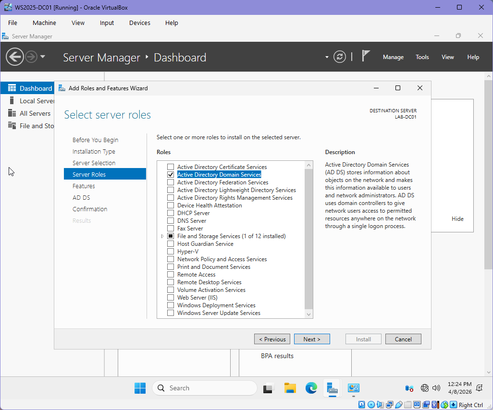
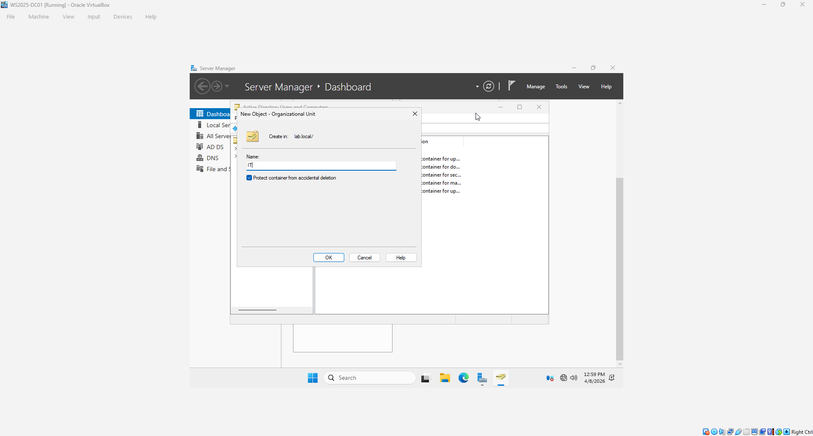
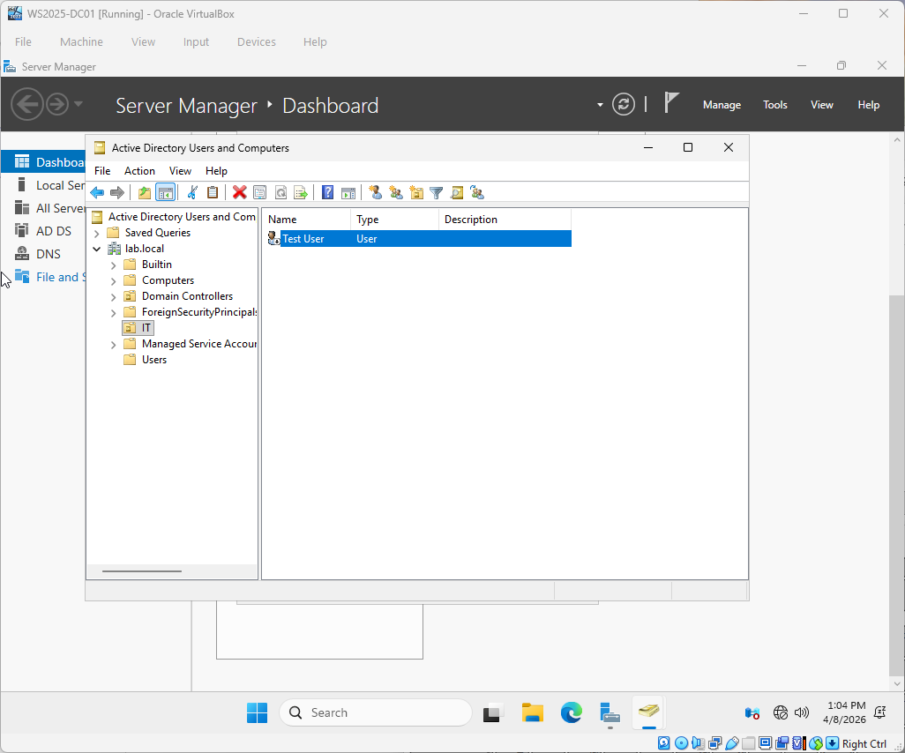
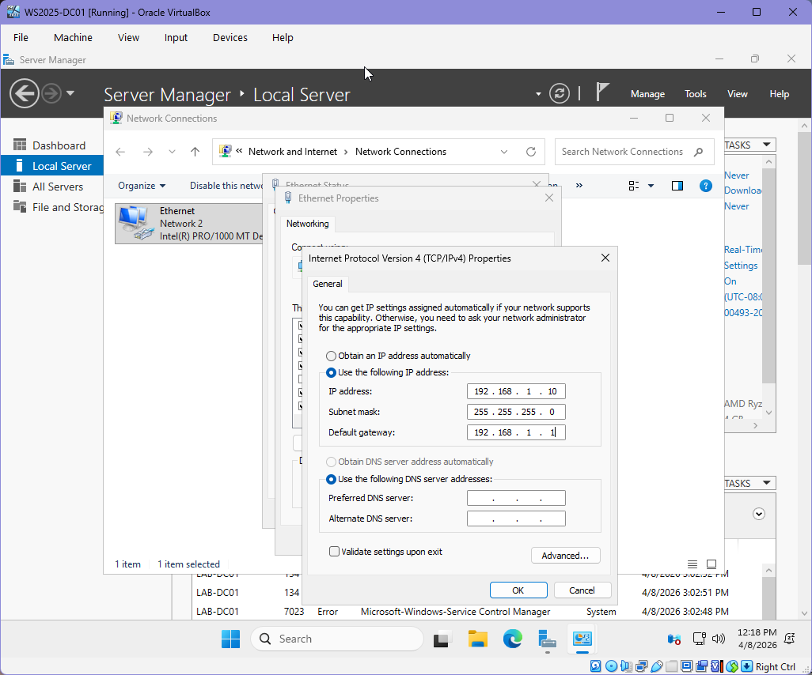

# Windows Server Active Directory Lab
## 🚀 Project Summary

Built and configured a Windows Server 2025 Active Directory environment using Oracle VirtualBox.  
This lab demonstrates hands-on experience with domain controller setup, DNS configuration, Group Policy, and troubleshooting real-world system failures.

## 🧠 Skills Demonstrated
- Active Directory Domain Services (AD DS)
- DNS Configuration
- Group Policy Management
- Windows Server Administration
- Virtualization (Oracle VirtualBox)
- Troubleshooting & Root Cause Analysis
  
## 🧪 Lab Environment
- Hypervisor: Oracle VirtualBox
- Server OS: Windows Server 2025 (Desktop Experience)
- Client OS: Windows 10/11 (planned)
- CPU: 2 cores
- RAM: 4 GB
- Disk: 50 GB
- Network: NAT

## ⚙️ Server Configuration
- Renamed server to WS2025-DC01
- Configured static IP address
- Set DNS to the local server

## 🏢 Active Directory Setup
- Installed Active Directory Domain Services (AD DS)
- Created new forest (lab.local)
- Promoted server to Domain Controller
- Configured Directory Services Restore Mode (DSRM)
  
## 🛠️ Tools & Technologies

- Windows Server 2025
- Oracle VirtualBox
- Windows 10/11 (Client Machine)
- Active Directory Domain Services
- DNS Server

  ## ⚠️ Key Challenges & Solutions

### Disk Partition Error During Installation
- **Cause:** Improper disk initialization
- **Fix:** Deleted all partitions and allowed automatic setup
- **Result:** Successful installation

### Server Core Installed Instead of Desktop Experience
- **Cause:** Incorrect OS selection
- **Fix:** Reinstalled using the Desktop Experience option
- **Result:** Full GUI access restored

### UEFI Boot Failure
- **Cause:** Boot mode mismatch in VirtualBox
- **Fix:** Disabled EFI and adjusted boot order
- **Result:** System booted successfully

 ## 📸 Lab Screenshots

### Active Directory Domain Services Installation

### Organizational Unit Creation

### User Creation
- Created a test user within Active Directory to simulate identity management.

### Active Directory Users & Computers

### Static IP Configuration

Configured a static IP address to ensure consistent network communication and proper DNS functionality.

## 🎯 Final Outcome

Successfully deployed a fully functional Active Directory lab environment, including:
- Domain Controller setup
- DNS configuration
- User and group management
- Group Policy enforcement
- This project demonstrates foundational system administration skills applicable to enterprise environments.

This environment simulates real-world enterprise infrastructure and prepares for system administration roles.

## 🔮 Future Improvements

- Add the client machine and join it to the domain
- Implement Group Policy Objects (GPOs)
- Configure file sharing and permissions
- Automate setup using PowerShell scripts
- Integrate with Azure AD (Hybrid Identity)
